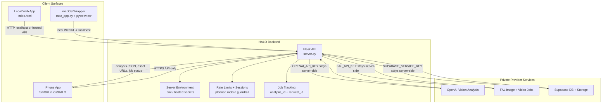
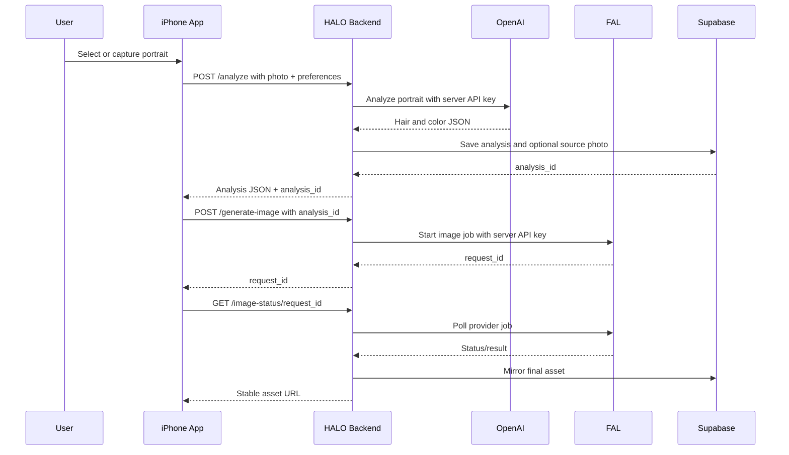

# HALO System Changes

This document describes the product shift from a local browser app to an
iPhone-first app with a server-owned API. The main change is the credential
boundary: the mobile app is treated as public and untrusted, while the backend
keeps all paid provider keys and service credentials.

## Current Direction

HALO now has three client surfaces:

- `index.html` - local web app for development, demos, and admin workflows.
- `mac_app.py` - macOS desktop wrapper that runs the Flask app locally in a
  native WebKit window.
- `ios/HALO` - native SwiftUI iPhone starter app that calls the HALO backend.

The iPhone app is the intended product direction. The web app remains useful as
a fast iteration surface and the macOS wrapper remains useful for desktop demos,
but neither should own OpenAI, FAL, or Supabase service credentials.

## Architecture Diagram



## Credential Boundary

Never ship these credentials in the iPhone app:

- `OPENAI_API_KEY`
- `FAL_API_KEY` or `FAL_KEY`
- `SUPABASE_SERVICE_KEY`
- Any future Stripe, email, admin, or service-role secrets

The iPhone app can safely contain:

- Public backend base URL
- App bundle identifier
- Non-secret feature flags
- A user/session token issued by the HALO backend or auth provider

For local development, the iOS app uses:

```text
HALO_API_BASE_URL = http://127.0.0.1:8765
```

For TestFlight or App Store builds, replace that with a hosted HTTPS backend:

```text
HALO_API_BASE_URL = https://api.your-halo-domain.com
```

## Request Flow



## Backend Responsibilities

The backend owns the expensive and private work:

- Load secrets from `.env` locally or hosted secret storage in production.
- Validate upload size and image type.
- Call OpenAI for analysis.
- Call FAL for generated images and videos.
- Persist analyses and generated assets.
- Enforce rate limits, credits, and abuse controls.
- Return stable IDs and URLs to clients.

## iPhone App Responsibilities

The iPhone app owns the user experience:

- Pick or capture a portrait.
- Collect style preferences.
- Upload to the HALO backend.
- Show progress while analysis/jobs run.
- Render results, palettes, generated images, and videos.
- Store only safe app state, such as session token and saved analysis IDs.

## Suggested Mobile API Shape

The current SwiftUI scaffold calls the existing `POST /analyze` endpoint. The
next backend cleanup should make the mobile API more explicit:

```text
POST /mobile/session
POST /mobile/analyze
GET  /mobile/analysis/<analysis_id>
POST /mobile/generate-image
POST /mobile/generate-video
GET  /mobile/job/<request_id>
```

This gives the app resumable state. If the app is closed during image or video
generation, it can reopen with `analysis_id` and continue polling jobs instead
of spending money on duplicate provider calls.

## Build Surfaces

| Surface | Path | Purpose |
|---|---|---|
| Web app | `index.html` | Fast local development and demo UI |
| Backend | `server.py` | Server-owned API and provider integration |
| macOS app | `mac_app.py` | Desktop wrapper around local Flask app |
| iPhone app | `ios/HALO` | Native SwiftUI mobile client |

## Open Work

- Deploy the Flask backend to a stable HTTPS host.
- Add mobile session creation and server-side rate limits.
- Store session/user token in iOS Keychain.
- Add camera capture to the SwiftUI app.
- Add image/video job polling UI.
- Add saved consultations and share/export flows.
